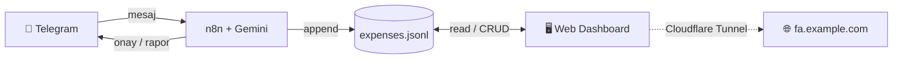

<div align="center">

# 💸 Telegram Finance Tracker

**Telegram üzerinden doğal dille gelir/gider kaydet, şık bir web panelinden takip et.**
*Log income & expenses in natural language via Telegram, track them on a sleek web dashboard.*

[](LICENSE)


[**Türkçe**](#-türkçe) · [**English**](#-english)

</div>

---

## 🧭 Genel Bakış / Overview

İki parçadan oluşur / Two parts:

1. **n8n workflow (Telegram bot)** — Telegram'a yazdığın mesajı Google Gemini ile sınıflandırır
   (gelir / gider / sorgu / silme), `expenses.jsonl` dosyasına yazar ve sana onay/rapor döner.
2. **Web Dashboard** — aynı `expenses.jsonl` dosyasını okuyup mobil-öncelikli, şık bir arayüzde
   gösterir; ekleme/düzenleme/silme (tam CRUD) yapar.



> Tek bir veri kaynağı vardır: `expenses.jsonl`. Bot ekler, dashboard okur ve düzenler.
> Single source of truth: `expenses.jsonl`. The bot appends, the dashboard reads & edits.

## 📸 Ekran Görüntüleri / Screenshots

| Özet / Overview | İşlemler / Transactions | Kayıt Ekle / Add |
|---|---|---|
|  |  |  |

> Kendi ekran görüntülerinizi `docs/screenshots/` klasörüne ekleyin.
> Drop your own screenshots into `docs/screenshots/`.

---

<a name="-türkçe"></a>
## 🇹🇷 Türkçe

### ✨ Özellikler
- 💬 **Doğal dil:** "100 tl market", "maaş yattı 50000", "kira geldi 15000", "8gb ram 1085 tl 3 taksit"
- 🤖 **Akıllı sınıflandırma:** Gelir / gider / sorgu / silme — Google Gemini ile
- 💳 **Taksit desteği:** Taksitli harcamalar otomatik aylara bölünür
- 📊 **Sorgu & rapor:** "bu ay net", "tasarruf oranımız ne", "geçen hafta yemek"
- 💱 **Çoklu döviz:** TL / EUR / USD / GBP (TL'ye çevrilerek özetlenir)
- 🖥️ **Mobil-öncelikli panel:** Net bakiye, aylık trend, kategori dağılımı, yaklaşan taksitler
- ✏️ **Tam CRUD:** Panelden de kayıt ekle / düzenle / sil
- 🔒 **Şifreli giriş:** httpOnly cookie + JWT
- 🎨 **Profesyonel arayüz:** Lucide ikonları, koyu tema, native uygulama hissi
- 📦 **Tek container:** Veritabanı yok — sadece bir JSONL dosyası

### 📋 Gereksinimler
- Çalışan bir **n8n** kurulumu ([n8n.io](https://n8n.io))
- **Telegram Bot Token** ([@BotFather](https://t.me/BotFather)'dan alın)
- **Google Gemini API Key** ([Google AI Studio](https://aistudio.google.com/app/apikey))
- Dashboard için **Docker** + Docker Compose

### 🚀 Kurulum

#### 1) n8n Workflow (Telegram Bot)

1. n8n'de **Import from File** ile `n8n/Telegram Harcama Kaydedici.json` dosyasını içe aktarın.
2. **Kimlik bilgilerini bağlayın:**
   - *Telegram Bot* → BotFather token'ınız (workflow'da `PUT_YOUR_TELEGRAM_CRED_ID` olan tüm node'lar).
   - *Google Gemini (PaLM) API* → Gemini API anahtarınız.
3. **Veri dosyası yolu:** Workflow `/data/downloads/expenses.jsonl` yoluna yazar. n8n
   konteynerinizde bu klasörün bir host klasörüne bağlı (mount) olduğundan emin olun. Örnek:
   ```yaml
   # n8n docker-compose içinde
   volumes:
     - /home/youruser/n8n_downloads:/data/downloads
   ```
   > Bu host yolunu (`/home/youruser/n8n_downloads`) dashboard'da da kullanacağız.
4. Workflow'u **Active** yapın ve Telegram'dan bota bir mesaj atarak test edin.

#### 2) Web Dashboard

```bash
git clone https://github.com/<kullanici>/telegram-finance-tracker.git
cd telegram-finance-tracker

cp .env.example .env
# .env dosyasını düzenleyin:
#   APP_PASSWORD       -> güçlü bir şifre
#   SESSION_SECRET     -> openssl rand -hex 32
#   N8N_DOWNLOADS_DIR  -> n8n'in expenses.jsonl yazdığı HOST klasörü

docker compose up -d --build
```

Panel artık `http://<sunucu-ip>:8095` adresinde. Giriş: `.env`'deki kullanıcı adı + şifre.

> **n8n veri yolunu bulma:**
> ```bash
> docker inspect <n8n-konteyner-adı> \
>   --format '{{range .Mounts}}{{.Source}} -> {{.Destination}}{{"\n"}}{{end}}'
> ```
> `/data/downloads` (veya benzeri) hedefine karşılık gelen **Source** yolunu
> `.env` içindeki `N8N_DOWNLOADS_DIR`'e yazın.

#### 3) (İsteğe bağlı) Cloudflare Tunnel ile uzaktan erişim

Token tabanlı bir cloudflared kullanıyorsanız, **Zero Trust → Networks → Tunnels →
Public Hostname → Add**:
- **Subdomain:** `fa`  **Domain:** `example.com`
- **Service:** `HTTP` → `<sunucu-lan-ip>:8095`

Birkaç dakikada `https://fa.example.com` üzerinden erişilir (TLS Cloudflare'de).

### 💬 Kullanım (Telegram)

| Niyet | Örnek mesaj |
|---|---|
| Gider | `100 tl market`, `kahve 50`, `akşam yemeği 250` |
| Gelir | `maaş yattı 50000`, `freelance 3000 dolar`, `kira geldi 15000` |
| Taksit | `1085 tl 8gb ram aldım 3 taksit böldüm` |
| Sorgu | `bu ay net`, `tasarruf oranımız ne`, `geçen hafta yemek` |
| Silme | `son kaydı sil`, `100 tl market harcamasını sil`, `dünkü maaşı sil` |

### 🖥️ Kullanım (Dashboard)
- **Özet:** net bakiye, gelir/gider, tasarruf oranı, aylık trend, kategori dağılımı, yaklaşan taksitler
- **İşlemler:** güne göre gruplu liste; ara, türe/kişiye göre süz
- **+ (FAB):** yeni kayıt ekle (taksitli dahil)
- Bir işleme dokun → düzenle veya sil (taksitliyse tüm seriyi silebilirsin)
- Üstteki **dönem çipleriyle** (Bu Ay, Geçen Ay, Son 3 Ay, Bu Yıl, Tümü, Özel) tarih aralığını seç

---

<a name="-english"></a>
## 🇬🇧 English

### ✨ Features
- 💬 **Natural language:** "100 tl market", "salary 50000", "rent income 15000", "8gb ram 1085 3 installments"
- 🤖 **Smart classification:** income / expense / query / delete — via Google Gemini
- 💳 **Installments:** installment purchases are auto-split across months
- 📊 **Queries & reports:** "net this month", "what's our savings rate", "food last week"
- 💱 **Multi-currency:** TRY / EUR / USD / GBP (summarized in TRY)
- 🖥️ **Mobile-first dashboard:** net balance, monthly trend, category breakdown, upcoming installments
- ✏️ **Full CRUD:** add / edit / delete from the dashboard too
- 🔒 **Password login:** httpOnly cookie + JWT
- 🎨 **Professional UI:** Lucide icons, dark theme, native-app feel
- 📦 **Single container:** no database — just a JSONL file

> The bot's prompts and messages are in **Turkish**. To use English, translate the prompt
> texts inside the n8n workflow's LLM nodes.

### 📋 Prerequisites
- A running **n8n** instance ([n8n.io](https://n8n.io))
- A **Telegram Bot Token** (from [@BotFather](https://t.me/BotFather))
- A **Google Gemini API Key** ([Google AI Studio](https://aistudio.google.com/app/apikey))
- **Docker** + Docker Compose for the dashboard

### 🚀 Setup

#### 1) n8n Workflow (Telegram bot)
1. In n8n, **Import from File** → `n8n/Telegram Harcama Kaydedici.json`.
2. **Connect credentials:** Telegram Bot token (every `PUT_YOUR_TELEGRAM_CRED_ID` node) and
   the Google Gemini (PaLM) API key.
3. **Data path:** the workflow writes to `/data/downloads/expenses.jsonl`. Make sure that folder
   in your n8n container is bind-mounted to a host folder, e.g.:
   ```yaml
   volumes:
     - /home/youruser/n8n_downloads:/data/downloads
   ```
4. Set the workflow **Active** and message your bot to test.

#### 2) Web Dashboard
```bash
git clone https://github.com/<user>/telegram-finance-tracker.git
cd telegram-finance-tracker

cp .env.example .env
# Edit .env:
#   APP_PASSWORD       -> a strong password
#   SESSION_SECRET     -> openssl rand -hex 32
#   N8N_DOWNLOADS_DIR  -> the HOST folder n8n writes expenses.jsonl into

docker compose up -d --build
```
Open `http://<server-ip>:8095` and log in with the credentials from `.env`.

> **Find the n8n data path:**
> ```bash
> docker inspect <n8n-container> \
>   --format '{{range .Mounts}}{{.Source}} -> {{.Destination}}{{"\n"}}{{end}}'
> ```
> Put the **Source** that maps to `/data/downloads` into `N8N_DOWNLOADS_DIR`.

#### 3) (Optional) Remote access via Cloudflare Tunnel
With a token-based cloudflared, in **Zero Trust → Networks → Tunnels → Public Hostname → Add**:
- **Subdomain:** `fa`  **Domain:** `example.com`
- **Service:** `HTTP` → `<server-lan-ip>:8095`

### 🖥️ Dashboard usage
- **Overview:** net balance, income/expense, savings rate, monthly trend, category breakdown, upcoming installments
- **Transactions:** grouped by day; search, filter by type/person
- **+ (FAB):** add a new record (installments supported)
- Tap a transaction → edit or delete (delete the whole series if it's an installment)
- Use the **period chips** up top to change the date range

---

## ⚙️ Yapılandırma / Configuration

| Değişken / Variable | Varsayılan / Default | Açıklama / Description |
|---|---|---|
| `APP_PASSWORD` | — (zorunlu) | Giriş şifresi / Login password |
| `SESSION_SECRET` | — (zorunlu) | JWT imzalama anahtarı / JWT signing key |
| `APP_USERNAME` | `admin` | Giriş kullanıcı adı / Login username |
| `N8N_DOWNLOADS_DIR` | `./data/downloads` | `expenses.jsonl`'in host klasörü / host folder |
| `APP_PORT` | `8095` | Host portu / Host port |
| `APP_UID` / `APP_GID` | `1000` | Konteyner kullanıcısı (dosya sahibiyle aynı olmalı) / container user (must match file owner) |
| `TOKEN_TTL_DAYS` | `30` | Oturum süresi (gün) / Session lifetime (days) |
| `CURRENCY_RATES` | `{"TL":1,"EUR":47,"USD":41,"GBP":53}` | TL'ye çevrim kurları / TRY conversion rates |

## 🗂️ Veri Formatı / Data Format

`expenses.jsonl` — her satır bir JSON kaydı / one JSON record per line:

```json
{"type":"expense","ts":"2026-06-18 14:30:00","user":"Buğra","amount":100,
 "currency":"TL","category":"market","description":"market alışverişi",
 "raw":"100 tl market","confidence":0.95}
```

Taksitli kayıtlarda ek alanlar / installment records add:
`installment_total`, `installment_index`, `installment_count`.

## 🔐 Güvenlik / Security
- Panel herkese açık bir domain'e veriliyorsa **güçlü** `APP_PASSWORD` kullanın.
  Use a **strong** `APP_PASSWORD` if the dashboard is exposed publicly.
- İsterseniz ek katman olarak **Cloudflare Access** (Zero Trust) ekleyin.
  Optionally add **Cloudflare Access** as an extra layer.
- `.env` dosyasını **asla** commit'lemeyin (`.gitignore`'da). Never commit `.env`.

## 🧱 Teknoloji / Tech Stack
- **Backend:** Node.js + Express (JWT auth, atomik dosya yazımı / atomic file writes)
- **Frontend:** Vanilla JS + [Chart.js](https://www.chartjs.org/) + [Lucide](https://lucide.dev/) (inline SVG)
- **Bot/Automation:** [n8n](https://n8n.io) + [Google Gemini](https://ai.google.dev/)
- **Deploy:** Docker / Docker Compose (+ Cloudflare Tunnel opsiyonel)

## 🤝 Katkı / Contributing
Pull request ve issue'lar memnuniyetle karşılanır.
PRs and issues are welcome.

## 📄 Lisans / License
[MIT](LICENSE)

## 🙏 Teşekkürler / Credits
[n8n](https://n8n.io) · [Chart.js](https://www.chartjs.org/) · [Lucide](https://lucide.dev/) · [Google Gemini](https://ai.google.dev/)
